# ADB Server

*APK Pusher*: a self-hosted app that watches GitHub repos for new APK
releases, verifies them, stages them, and pushes them over wireless ADB to
Android devices you've explicitly trusted.

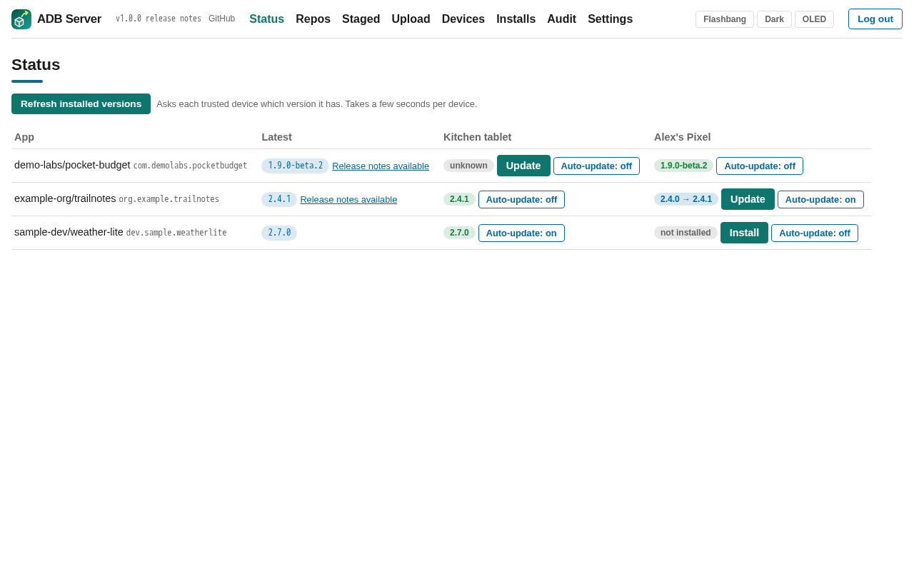

- **Watches GitHub releases** and downloads matching APKs as soon as they're
  published, including per-ABI builds and, if you ask, pre-releases.
- **Verifies every APK** before it can reach a device: the signature must
  verify, and the package name and signing certificate must match the ones
  pinned for that repo on its first release.
- **Pushes to your phones** with one click, or automatically for apps a device
  follows. It re-confirms the device's identity and trust right before every
  install.
- **Pairs phones by QR code or pairing code**, and finds them again when
  wireless debugging moves to a new port.
- **Has a security posture made for a home server:** two-factor sign-in, an
  audit log, no client-side JavaScript, hardened containers, and an ADB port
  that never touches your LAN. See [Security](#security).

*All screenshots in this README come from a throwaway test stack filled with
invented data. The repos, devices, serials, addresses and hashes are all made
up.*

## Contents

- [How it fits together](#how-it-fits-together)
- [Quickstart](#quickstart)
- [Features](#features)
- [Release verification](#release-verification)
- [Security](#security)
- [Configuration](#configuration)
- [Development](#development)
- [Non-goals](#non-goals-v1)

## How it fits together

Three containers, defined in `docker-compose.yml`:

| Container | What it does | Network |
|---|---|---|
| **app** | FastAPI + SQLite. Polls GitHub, verifies and stages releases, serves the web UI, and drives `adb` to pair, connect and install. | Private compose network. Publishes port 8080. |
| **adb-server** | Runs the `adb` server and holds its private key, the identity every paired phone trusts. | Private compose network only. **No published port.** |
| **mdns** | Listens for the mDNS announcement a phone makes after scanning a pairing QR code, and writes what it hears to a file the app reads (read-only). | Host network (multicast can't cross Docker's bridge). Listens only. Holds no keys. |

```
 browser ──HTTP(S)──▶ app ──adb protocol──▶ adb-server ──TLS (wireless ADB)──▶ phones
                       ▲                                                        │
                       └──── read-only file ◀── mdns ◀── mDNS announcements ────┘
 GitHub API ◀──HTTPS── app (release polling, asset downloads)
```

## Quickstart

```bash
cp .env.example .env
chmod 600 .env                 # it holds the session key and your password
# edit .env: SECRET_KEY (openssl rand -hex 32), APP_USERNAME, APP_PASSWORD,
# and ALLOWED_HOSTS (the name or IP you'll browse to)
docker compose up -d --build
```

Then open `http://<server>:8080`, sign in, and:

1. **Settings → Security**: turn on two-factor sign-in.
2. **Repos**: add the GitHub repos you want to follow.
3. **Devices**: pair your phone (the QR code is quickest), and trust it.

> **Plain HTTP or TLS?** Out of the box the UI is served over plain HTTP on
> all interfaces. That's a deliberate trade-off for a trusted home network
> (see [Known limitations](#known-limitations-and-accepted-risks)). Browsers
> won't send `Secure` cookies over plain HTTP to anything but `localhost`, so
> for `http://<LAN-IP>:8080` set `COOKIE_SECURE=false`. The better setup is
> TLS: put a reverse proxy (Caddy, Tailscale Serve, …) in front, keep
> `COOKIE_SECURE=true`, set `ALLOWED_ORIGIN=https://<your-name>`, and bind the
> app to `127.0.0.1:8080` in `docker-compose.yml`.

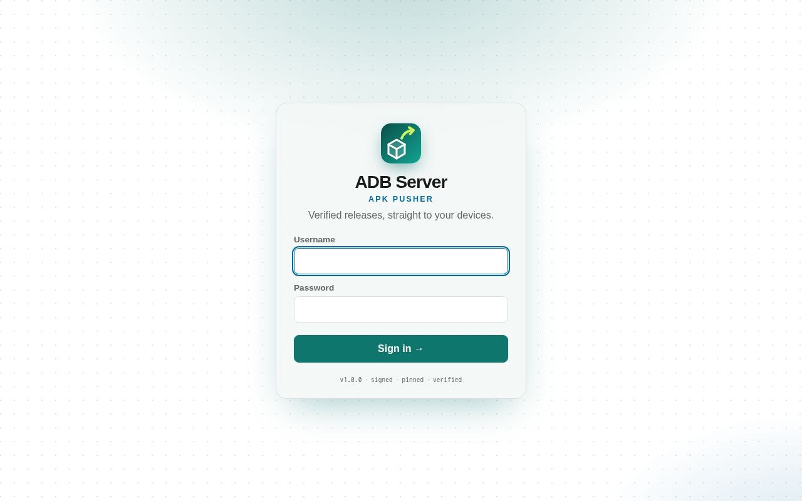

## Features

### Status: the home page

Every watched app against every trusted device: the installed version, the
latest staged version, and an **Update** or **Install** button. The button
picks the right APK for that device's CPU and asks you to confirm first.
**Refresh installed versions** asks each device what it has now; versions also
refresh after every push. When a release has notes, a link takes you to them.

**Auto-update** is set per app and per device. When it's on, each newly staged
release is pushed to that device automatically. This only works for trusted
devices, and a device that already has that version or a newer one is skipped.

<p>
  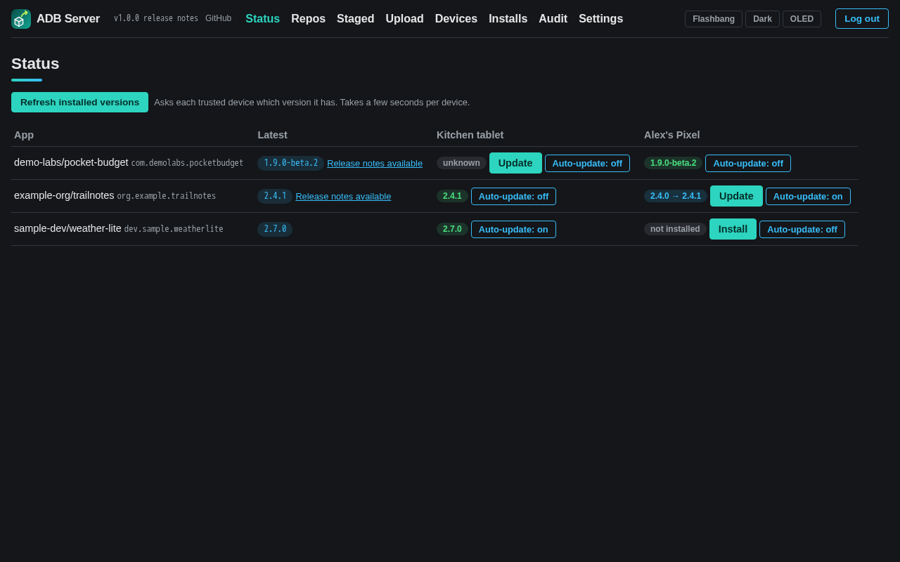
  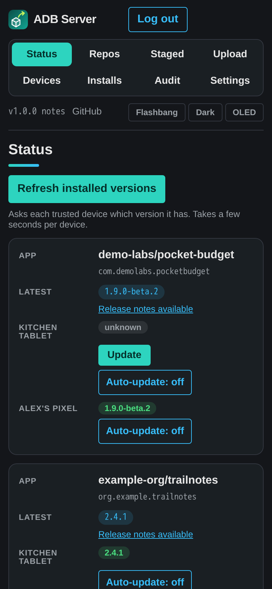
</p>

### Repos

Add a GitHub repo as a URL, `owner/repo` or an SSH remote, plus an asset glob
(default `*.apk`). Repos are polled every `POLL_INTERVAL_MINUTES` (default 10).
**Check now** checks immediately, in the background. Pre-releases are ignored
unless you choose **Include pre-releases** for that repo. Polls use
conditional requests (ETags), so an unchanged repo doesn't use up GitHub's
rate limit.

When a release is signed by a different certificate than the pinned one, a
**Signing change** panel shows both certificates and whether the new APK
proves the rotation (see [Release verification](#release-verification)).

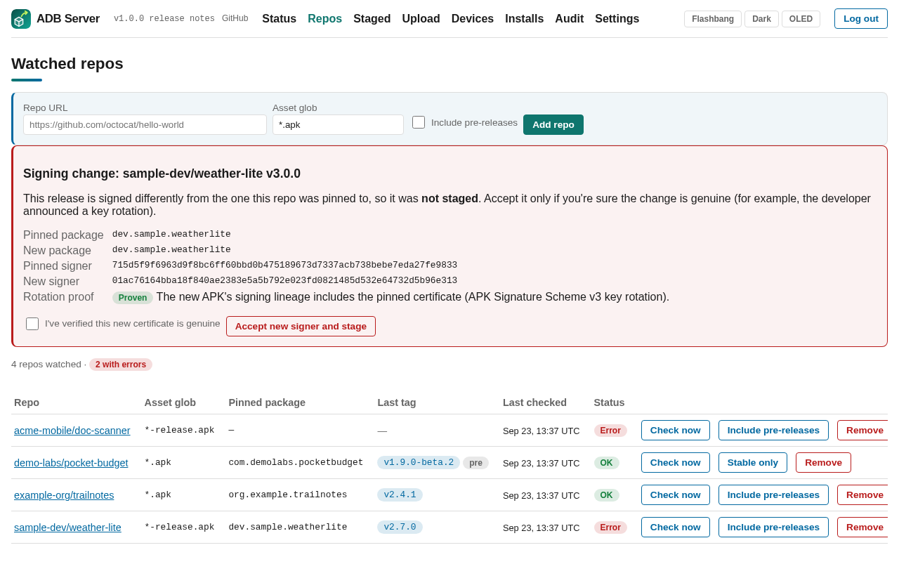

### Staged APKs

Every verified release lands here. When a release has several APKs that match
the glob (per-ABI builds such as `arm64-v8a`, `armeabi-v7a` or universal), all
of them are staged, up to 6. A push refuses an APK the device's CPU can't run.
Release notes open in a full-width panel under their APK.

Only the newest `KEEP_RELEASES_PER_REPO` releases per repo (default 3) are
kept on disk. Older ones are deleted automatically, and you can delete any
file by hand. Install history is kept either way.

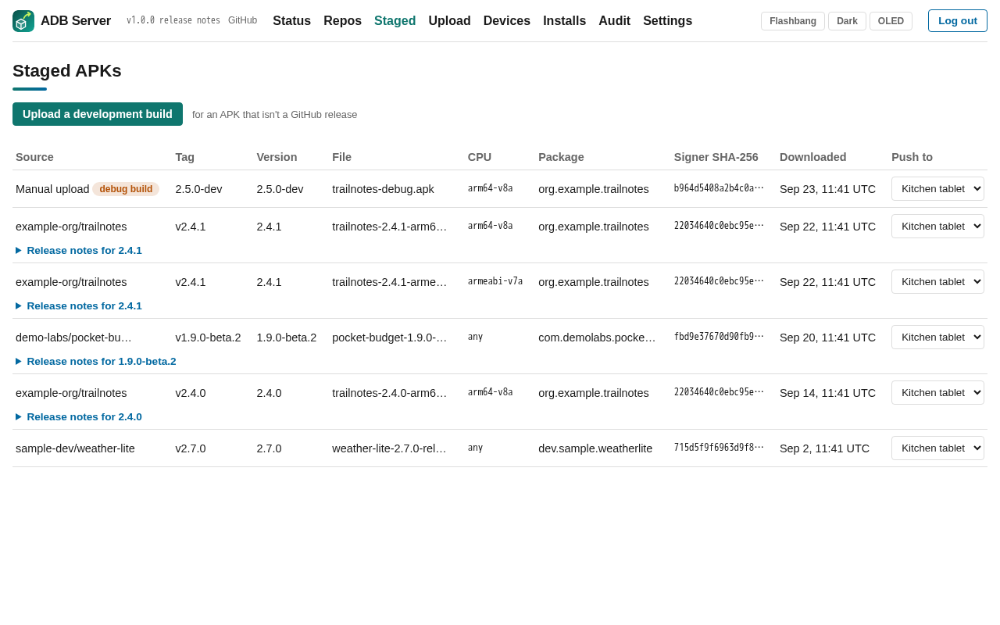

### Upload a development build

The **Upload** page stages an APK directly (up to 500 MB), for builds that
aren't published as GitHub releases. Its signature must still verify, and its
signer is recorded. It belongs to no watched repo, so it neither sets nor is
checked against a repo's pin: you, the uploader, are its provenance. Uploads
may be debug-signed. Staging a dev build is the point of this page, and such
builds are marked **debug build** for as long as they stay staged. If the
upload's package matches a watched repo but its signer doesn't, you're warned
that Android will refuse one over the other. Re-uploading a file that's
already staged is refused.

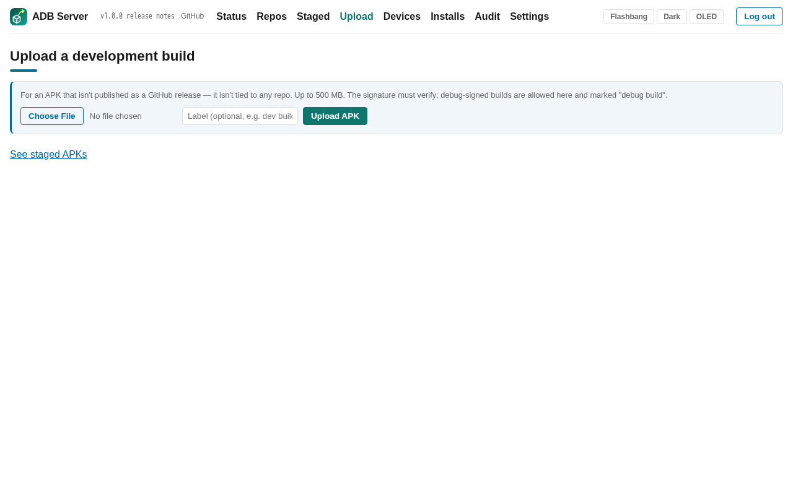

### Devices

**Pair with QR code**: on the phone, open Settings → Developer options →
Wireless debugging → *Pair device with QR code* and scan the code on screen.
The page refreshes every 2 seconds and pairs as soon as the phone announces
itself. A phone paired this way is **trusted straight away**: only the phone
that scanned the single-use code can complete the pairing. The page says so,
and the audit log records it. Each code works once and expires after 3
minutes. QR pairing needs the `mdns` container running.

**Pair with a code**: enter the pairing address and 6-digit code the phone
shows, plus its connect address. A device paired this way starts **untrusted**.
Trust it explicitly before it can receive pushes.

The connect port changes whenever wireless debugging restarts. Before every
push, the app reconnects to the device. If the stored port is dead, it scans
the device's last known IP (`ADB_SCAN_PORTS`, default `30000-49999`) and
accepts a port only if the device there reports the **same hardware serial**.
**Find** does this on demand. If the phone's IP itself changed, use
**Reconnect** with its new address. Nicknames, trust and forgetting a device
are all on this page. Phones list this server as `@adbserver`.

<p>
  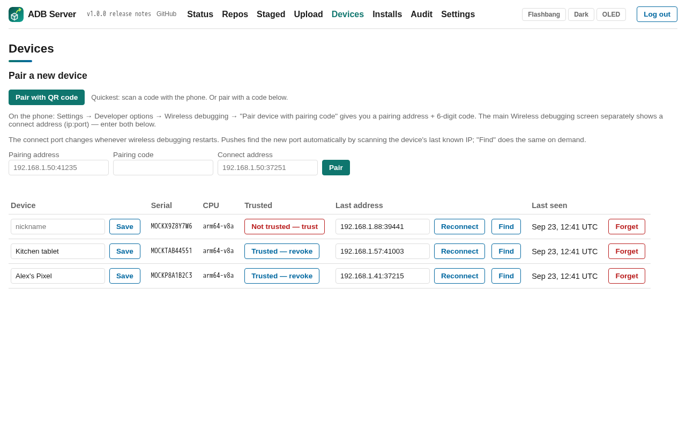
  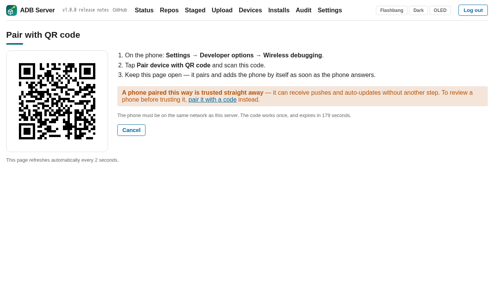
</p>

### Installs

Every push runs in the background. Submitting one takes you to a live status
page that refreshes until the install finishes, including `adb`'s own output.
The **Installs** page keeps the full history.

<p>
  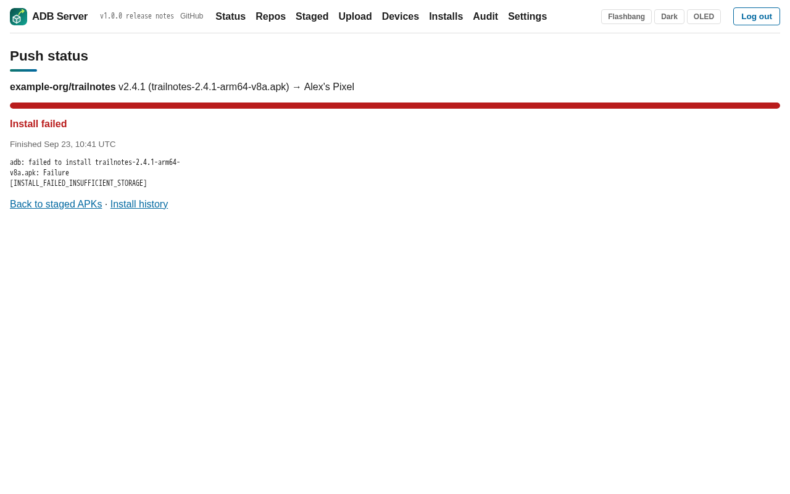
  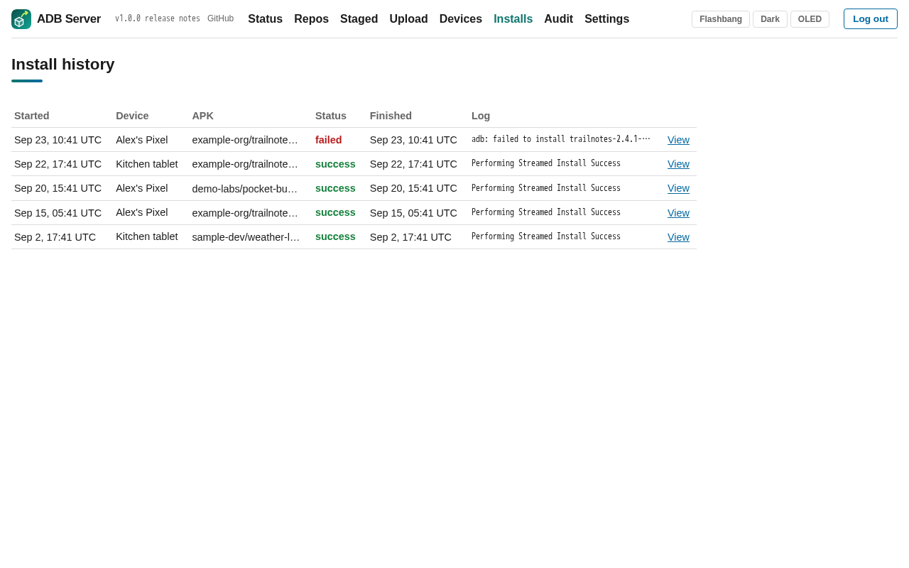
</p>

### Audit log

Logins (including failed ones and how the second step was passed), two-factor
changes, trust changes, signer re-pins, repo and device changes, uploads,
auto-update toggles, pushes and notification changes, each with the client IP.
The newest 5000 entries are kept. Secrets are never written to it.

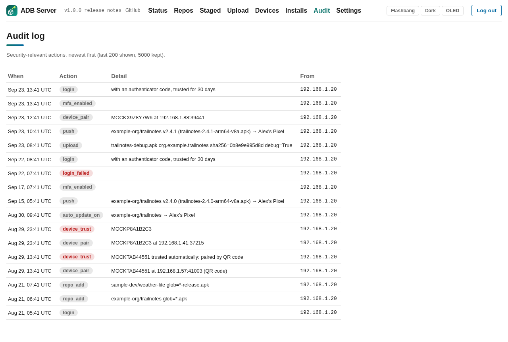

### Notifications

Notifications go through [Apprise](https://github.com/caronc/apprise/wiki),
which covers ntfy, Gotify, Home Assistant, Discord, Telegram, email, plain JSON
webhooks and about 100 more services, one URL each. You can be told when a
release is staged or rejected, and when a push succeeds or fails.

On **Settings → Notifications** you can:

- **Add an Apprise server** ([Apprise API](https://github.com/caronc/apprise-api)):
  paste its notify URL (e.g. `http://apprise.local:8000/notify/my-key`), or
  its address and config key, plus optional tags. The services themselves
  stay managed on the Apprise server.
- **Add a service directly**: any single Apprise URL.
- Pick which events notify, and **Send test** to one service or to all.
  Each test reports whether the message was delivered. The add forms have a
  **Test** button too, for trying a URL before you save it. A URL guide for
  common services is on the page.

Tokens and passwords in a URL are shown masked and never logged. `APPRISE_URLS`
and `NOTIFY_EVENTS` in `.env` also work: those services appear marked `.env`
and can only be changed there. Events saved on the page override
`NOTIFY_EVENTS`.

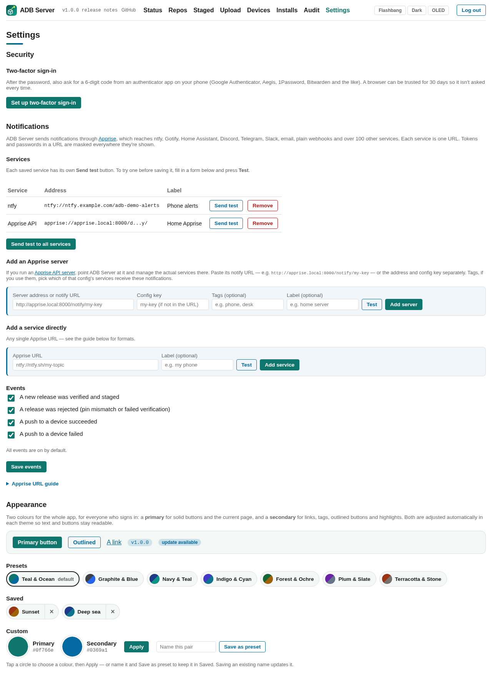

### Appearance

**Settings → Appearance** sets two colours for the whole app: a **primary**
(solid buttons, the current page) and a **secondary** (links, tags, outlined
buttons, focus rings). Pick a preset pair or any two custom colours. Name a
custom pair and **Save as preset** to keep it. Colours are darkened or
lightened per theme so text stays readable (WCAG AA contrast). The header's
**Flashbang / Dark / OLED** buttons pick a theme for this browser. Without
one, the app follows your OS's light/dark setting. The layout adapts to phones
and tablets (labelled cards up to 960px wide).

### Two-factor sign-in

**Settings → Security** adds a second step after the password: a 6-digit code
from any authenticator app (TOTP: Google Authenticator, Aegis, 1Password,
Bitwarden, …). Setup shows a QR code, then 10 single-use **recovery codes**.
Save them, because they're shown only once. When you sign in you can tick
**Trust this browser for 30 days**. Trusted browsers are listed in Settings,
where you can revoke one or all. Turning two-factor off, or making new
recovery codes, needs a current code.

<p>
  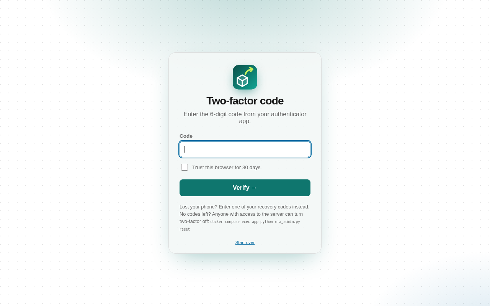
  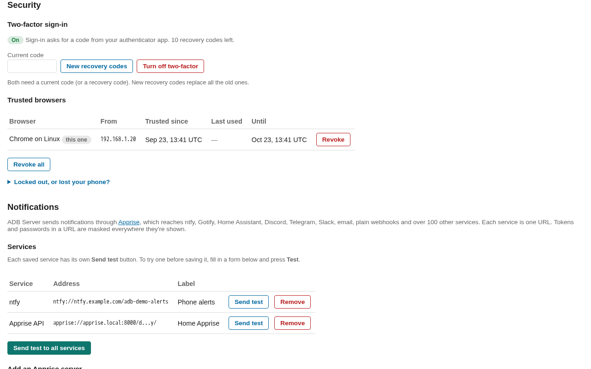
</p>

If you're locked out, or you've lost both your phone and your recovery codes,
run these from the server:

```sh
docker compose exec app python mfa_admin.py status
docker compose exec app python mfa_admin.py unlock   # clear the lockout after too many wrong codes
docker compose exec app python mfa_admin.py reset    # turn two-factor off and sign everyone out
```

### Header links

Next to the logo, the running version links to **its release notes** on
GitHub (`…/releases/tag/v<version>`), and **GitHub** links to this
repository.

### Health checks

Every container has a Docker health check. `app` checks `/healthz`, which is
unauthenticated and returns only ok or error. `adb-server` checks that the adb
server answers, and `mdns` checks that its file exists. `127.0.0.1` is always
an accepted host, so the check works whatever `ALLOWED_HOSTS` says. If the UI
answers a bare "Invalid host header", the name you browsed to isn't in
`ALLOWED_HOSTS`. The app logs the accepted list at startup.

## Release verification

- **Trust on first use, then pinned.** The first release staged for a repo
  pins its **package name** and **signing certificate SHA-256**. Every later
  release must match both. A mismatch is rejected and shown on the Repos page.
  It is never skipped silently and never trusted automatically. This stops a
  compromised upstream account, or a malicious asset uploaded to someone
  else's release, from reaching your devices unnoticed.
- **Every signer counts.** All of an APK's signers are checked and pinned,
  not just the first.
- **Unsigned APKs are always rejected**, and so is a **debug-signed polled
  release**. The default Android debug certificate is generated per machine
  and identifies nobody, and nobody is watching when the poller runs. A
  debug-signed release never becomes a pin.
- **One release, one identity.** Every APK in a release must share the same
  package and signer, or the whole release is rejected.
- **Signing-key rotation** is a reviewed decision. The Repos page shows both
  certificates and whether the new APK carries an APK Signature Scheme v3
  proof-of-rotation linking it to the pinned key. Accepting the new
  certificate re-pins the repo and stages that release. The acceptance is
  written to the audit log.
- **Integrity checks.** Downloads are capped at 500 MB, must be real APK
  archives (a zip with an `AndroidManifest.xml`), and must match GitHub's
  reported SHA-256 digest when GitHub provides one.
- **Rejected once.** A rejected release is checked once, then skipped (with
  the error still visible) until a newer release appears.

## Security

ADB Server can install software on your phones, so it's built with
**defence in depth**. No single control is trusted to stop everything. This
section covers what is protected, how, and what isn't.

### Threat model

It's designed for **one operator on a home or small-office network**.

| It defends against | How |
|---|---|
| A compromised or malicious upstream: a hijacked GitHub account, a tampered release asset | Package and signer pinning, signature verification, reviewed key rotation ([Release verification](#release-verification)) |
| Someone on the LAN trying to reach your phones' ADB | The adb server's port is never published. Only the app can talk to it. |
| Password guessing, stolen passwords | Per-IP rate limiting, TOTP two-factor sign-in, a global lockout on wrong codes |
| Cross-site attacks from other tabs or sites | CSRF tokens, Origin checks, `SameSite=Strict` cookies, a strict CSP with no JavaScript at all |
| DNS rebinding | A Host-header allowlist (`ALLOWED_HOSTS`) |
| Stolen session cookies | 12-hour expiry, and logout revokes every session |
| Pushing to the wrong phone | Hardware-serial identity checks and a trust re-check immediately before every install |
| Unauthenticated resource exhaustion | Request size caps enforced before a body is read |

**Out of scope.** It does not defend against someone who holds your password
*and* your second factor, anyone with root or Docker access on the host, or
passive sniffing on your LAN if you serve it over plain HTTP (use TLS; see
below).

### Authentication

- **Fails closed.** The app refuses to start without `SECRET_KEY`,
  `APP_USERNAME` and `APP_PASSWORD`, or with a placeholder password such as
  `changeme`.
- **Constant-time credential checks.** The username and password are both
  compared every time, so response timing doesn't reveal which one was wrong.
- **Rate limiting.** 5 failed attempts per client IP in 5 minutes, for both the
  password and the code step. The tracking table is swept and capped, so a
  flood of addresses can't grow it without bound.
- **Two-factor sign-in (TOTP, RFC 6238).** The implementation uses only the
  standard library (HMAC-SHA1, 30-second steps, ±1 step for clock drift), so
  there's no third-party dependency to trust. The password alone only yields
  a 5-minute pending cookie that unlocks the code form, nothing else.
  - A code works **once**, even inside its 30-second window. The used step is
    claimed atomically, so parallel requests can't spend the same code twice.
  - **5 wrong codes lock the second step for 15 minutes**, globally rather than
    per IP, because whoever gets that far already has the password. Attempts
    are counted *before* a code is checked, so a burst of parallel guesses
    can't get more than 5 tries.
  - **Recovery codes**: 10 single-use codes with about 49 bits of entropy each,
    stored only as SHA-256 hashes.
  - **Trusted browsers**: a signed cookie holding a random token. Only the
    token's hash is stored, so a trusted browser can be revoked from Settings,
    and a copy of the database can't be replayed as a trust cookie.
  - Turning two-factor **on** signs out every other session. Turning it
    **off**, or replacing recovery codes, needs a current code.
  - **Server-side recovery** (`mfa_admin.py`) needs a shell on the host. That's
    the proof of ownership, because a shell already means full control.

### Sessions and requests

- **Session cookies** are signed (itsdangerous, HMAC with `SECRET_KEY`),
  `HttpOnly`, `SameSite=Strict`, `Secure` (unless `COOKIE_SECURE=false`), and
  expire after 12 hours.
- **Revocation.** Every cookie carries a session epoch. Logging out,
  enabling two-factor, or `mfa_admin.py reset` bumps the epoch, which signs
  out **every** session, so a copied cookie stops working too.
- **CSRF.** Every state-changing request needs a per-session token in the form
  body, compared in constant time. The `Origin` header must also match, when
  the browser sends one. The login form has no session yet, so the Origin
  check is its cross-site defence.
- **Host allowlist.** Requests for any host not in `ALLOWED_HOSTS` are refused,
  which blocks DNS-rebinding attacks.
- **Body limits before parsing.** FastAPI reads a request body before any
  auth check runs, so limits are enforced in middleware, before anything is
  read. Every POST must declare its length. Forms are capped at 64 KB. Only
  the upload route accepts files, and only from a signed-in session, up to
  500 MB. Anyone else who can reach the port can't fill the disk.
- **Browser hardening.** The app ships **no JavaScript**. Dialogs, live pages
  and navigation use plain HTML and CSS. The Content-Security-Policy is
  `default-src 'self'; style-src 'self'; script-src 'none'; frame-ancestors
  'none'; base-uri 'none'; form-action 'self'`. Pages are sent with
  `X-Frame-Options: DENY`, `X-Content-Type-Options: nosniff` and
  `Referrer-Policy: no-referrer`. Templates autoescape everything they
  render.
- **No open redirects.** Redirect targets come from a fixed allowlist of the
  app's own pages.
- **Secrets stay out of URLs.** Pages that show a secret (two-factor setup,
  recovery codes) are sent with `Cache-Control: no-store`. A notification URL
  you're testing is re-rendered in the form, never placed in a redirect.

### Devices and pushes

- **Untrusted by default.** A device paired with a pairing code can't receive
  anything until you trust it. Trust is enforced on the server, at queue time
  *and again at install time*, not by hiding a button.
- **QR-paired devices are trusted automatically**, because only the phone that
  scanned the one-time code, which carries a 16-character random password,
  can complete the pairing. The QR page says so, and the audit log records
  it. Pair with a code instead if you want to review a phone first.
- **Identity is the hardware serial** (`ro.serialno`), not the address. Before
  every push the app reconnects and confirms the serial. It never pushes to
  whatever happens to answer on an old address.
- **Upgrading older records.** Devices paired before 1.0 were stored under
  their `ip:port`. They're upgraded to their serial the first time they're
  found. Re-pairing one keeps its nickname and history, but **clears trust**,
  because the same IP isn't proof of the same phone. An old record is never
  merged into a different phone that already has its own record.
- **Narrow network reach.** Device addresses must be literal IPs on private or
  loopback ranges (never hostnames, never public IPs), and they're checked so
  they can't be read as `adb` options. A port scan only ever touches the last
  known private IP of a device you already paired.
- **Safe installs.** Always `adb install -r`, never `-g` (grant all
  permissions), `-d` (allow downgrade) or `-t` (test APKs). Android's own
  signature check still refuses an update signed by a different key.
- **The mDNS data isn't trusted.** Announcements arrive unauthenticated from
  the LAN, so the app treats them as hints: the pairing itself (a PAKE
  handshake, which needs the password) is the proof. Only private IPv4
  addresses are accepted, and the listener's table is bounded. When it's
  full, the oldest entry is dropped, so a flood of fake announcements can't
  block a real phone.

### Manual uploads

- The signature must verify, exactly as for a polled release. Unsigned or
  malformed files are refused.
- The file is stored as `uploads/<sha256>.apk`. The name your browser sent is
  display text only, reduced to a safe character set, and is never used as a
  path.
- Debug-signed uploads are allowed but permanently marked **debug build**.
  You're warned when an upload's package matches a watched repo but its
  signer doesn't.

### GitHub access

- `GITHUB_TOKEN` is optional. When set, it should be a fine-grained,
  read-only token scoped to the repos you watch.
- The token is sent **only to `api.github.com`**. Asset downloads follow
  GitHub's redirect manually, without the `Authorization` header, only over
  HTTPS, and only to GitHub's own hosts.
- Owner and repo names are validated against a strict pattern. File paths are
  never built from tag or asset names, which are upstream-controlled.

### Containers and network

- **The adb server is never on the LAN.** Its port 5037 is unauthenticated by
  design, so it is published nowhere and reachable only from `app` over the
  private compose network. Never put `adb-server` on `network_mode: host`.
- **Least privilege everywhere.** All three containers run as a non-root user
  (uid 10001) with `cap_drop: [ALL]`, `no-new-privileges`, and a **read-only
  root filesystem**. Writable paths are only the data volumes and small
  tmpfs mounts.
- **The `mdns` sidecar** is the only container on host networking. It only
  listens, holds no keys, opens no port of its own besides mDNS, and reaches
  the app only through a file the app mounts read-only.
- **Verified tooling.** `adb`, `apksigner` and `aapt` come from Google's
  official releases, with pinned URLs and SHA-256 checksums verified at build
  time. They're never taken from third-party images.
- **Pinned bases.** Every base image is pinned by digest.

### Data at rest

| Data | Where | Protection |
|---|---|---|
| adb private key (every paired phone trusts it) | `adbkeys` volume | Only `adb-server` mounts it |
| Database: repos, devices, audit log, settings | `appdata` volume (`/data/app.db`) | Only `app` mounts it |
| TOTP secret, notification service URLs | In the database | **Not encrypted.** Same protection as `.env` and the volume. |
| Recovery codes, trusted-browser tokens | In the database | SHA-256 hashes only |
| `SECRET_KEY`, password, `GITHUB_TOKEN` | `.env` | Keep it `chmod 600`. It's gitignored and excluded from image builds. |

Anyone who can read the `appdata` or `adbkeys` volumes, or `.env`, can act as
this server. Back those up, and protect the backups the same way.

### Supply chain and CI

- Every Python dependency is pinned to an exact, current version and audited
  with `pip-audit` in CI (`--strict`, covering `app` and `mdns`).
- Dependabot watches pip, the digest-pinned Docker base images and GitHub
  Actions weekly.
- Actions are pinned by commit SHA, with least-privilege `permissions:`.
  Workflow changes are linted with a checksum-verified `actionlint`.
- A release publishes images only for a tag on the default branch that
  matches `VERSION`, and only for a commit CI already passed.

### Recommended hardening checklist

- [ ] Serve it over **TLS** (reverse proxy), keep `COOKIE_SECURE=true`, set
      `ALLOWED_ORIGIN`, and bind the app port to `127.0.0.1`.
- [ ] **Never expose port 8080 to the internet.** Use a VPN such as Tailscale
      for remote access.
- [ ] Set `ALLOWED_HOSTS` to exactly the names you browse to.
- [ ] Use a long, random `APP_PASSWORD` and `SECRET_KEY`.
- [ ] Turn on **two-factor sign-in**, and store the recovery codes offline.
- [ ] `chmod 600 .env`.
- [ ] Use a fine-grained, read-only `GITHUB_TOKEN`, or none for public repos.
- [ ] Pair with a code (not QR) when you want to review a device before
      trusting it.
- [ ] Back up the `appdata` and `adbkeys` volumes, and protect the backups.
- [ ] Review the **Audit** page from time to time, and the Repos page whenever
      a signing change is flagged.

### Known limitations and accepted risks

- **Plain HTTP by default.** On the LAN, the password and session cookie
  travel in cleartext unless you add TLS. This is a deliberate default for a
  trusted home network, and the first item on the checklist above.
- **Single operator.** There's one account with no roles. Anyone signed in can
  do everything, including pointing notifications at internal hosts, which is
  as powerful as pushing APKs anyway.
- **The two-factor lockout is global.** Someone who already has your password
  can keep the second step locked. Recovery codes and `mfa_admin.py unlock`
  get you back in.
- **No encryption at rest** for the TOTP secret or notification URLs (see
  above).
- **QR pairing auto-trusts** the paired phone (see above).

### Reporting a vulnerability

Please don't open a public issue. Use GitHub's private vulnerability reporting
(**Security → Report a vulnerability** on the repository), or contact the
maintainer directly.

### Security review

The whole codebase was reviewed from top to bottom for 1.0.0 (2026-09-23):
routes, authentication and two-factor, sessions and CSRF, uploads, APK
verification, GitHub access, device identity and pushes, QR pairing and the
mDNS sidecar, containers, CI and dependencies. `bandit` reports only reviewed
false positives (constant SQL fragments, and `subprocess` with argument lists
and validated input). `pip-audit` is clean, every pin is the latest release,
and Dependabot has no open alerts. Everything the review found was fixed
before release, with a regression test that fails without the fix. See
`CHANGELOG.md`.

## Configuration

All settings live in `.env` (copy `.env.example`).

| Variable | Default | What it does |
|---|---|---|
| `SECRET_KEY` | *(required)* | Signs cookies. `openssl rand -hex 32`. Changing it signs everyone out. |
| `APP_USERNAME`, `APP_PASSWORD` | *(required)* | The single operator account. |
| `ALLOWED_HOSTS` | `localhost,127.0.0.1` | Host names the app answers to (DNS-rebinding protection). |
| `ALLOWED_ORIGIN` | *(blank: same origin)* | Exact `scheme://host[:port]` forms may come from. Set it behind a TLS proxy. |
| `COOKIE_SECURE` | `true` | `false` only for plain-HTTP access to anything but localhost. |
| `GITHUB_TOKEN` | *(blank)* | Fine-grained, read-only PAT, for private repos or higher rate limits. |
| `POLL_INTERVAL_MINUTES` | `10` | How often repos are polled. |
| `KEEP_RELEASES_PER_REPO` | `3` | Staged releases kept on disk per repo. |
| `APPRISE_URLS` | *(blank)* | Notification services (space- or comma-separated). |
| `NOTIFY_EVENTS` | *(all)* | `staged,rejected,install_success,install_failed` |
| `ADB_SCAN_PORTS` | `30000-49999` | Port range scanned to find a device whose port changed. |
| `DB_PATH`, `STAGING_ROOT` | `/data/app.db`, `/data/staging` | Storage locations inside the app container. |
| `ADB_HOST`, `ADB_PORT` | `adb-server`, `5037` | Where the adb server is. |

## Development

```bash
python3 -m venv .venv && . .venv/bin/activate
pip install -r requirements-dev.txt
bash scripts/test.sh
```

The tests stub out GitHub, `adb`, `apksigner` and `aapt`, so they need no
Android tooling and no device.

CI (`.github/workflows/ci.yml`) runs on every push and PR. It runs the same
test script, checks that `VERSION` matches `CHANGELOG.md`, validates the
compose file, audits the dependencies and builds all three images. Pushing a
`v*` tag on the default branch runs `release.yml`, which publishes the images
to `ghcr.io/darthrater78/adb-server/{app,adb-server,mdns}` and creates the
GitHub release, but only for a commit CI already passed.

## Non-goals (v1)

- Multi-user accounts or roles.
- Push-to-all: one device per push (auto-update covers the rest).
