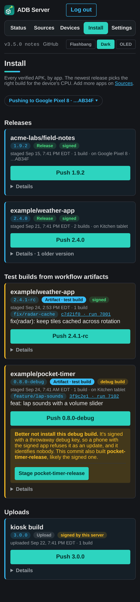
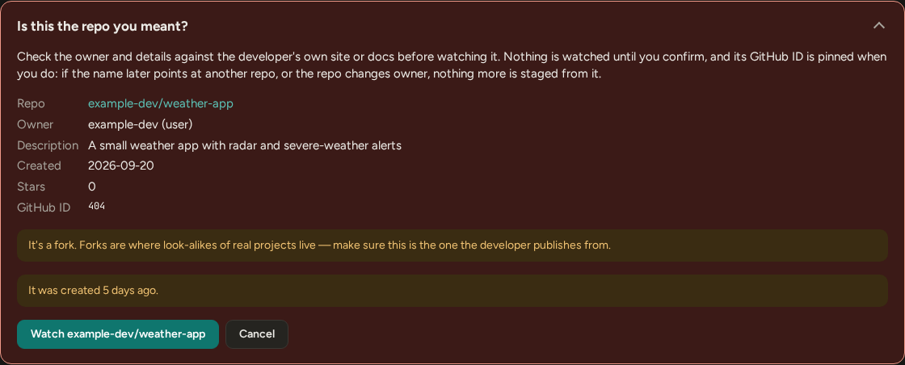
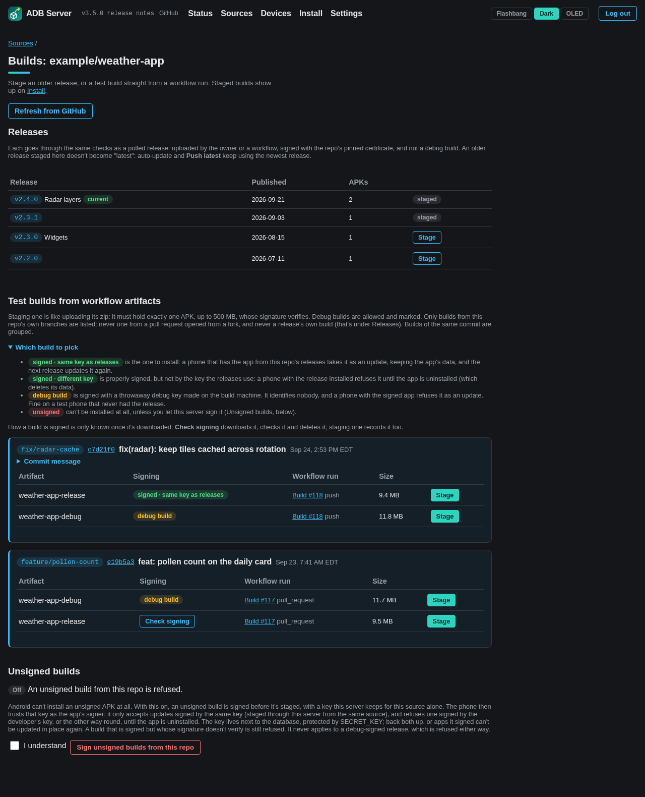
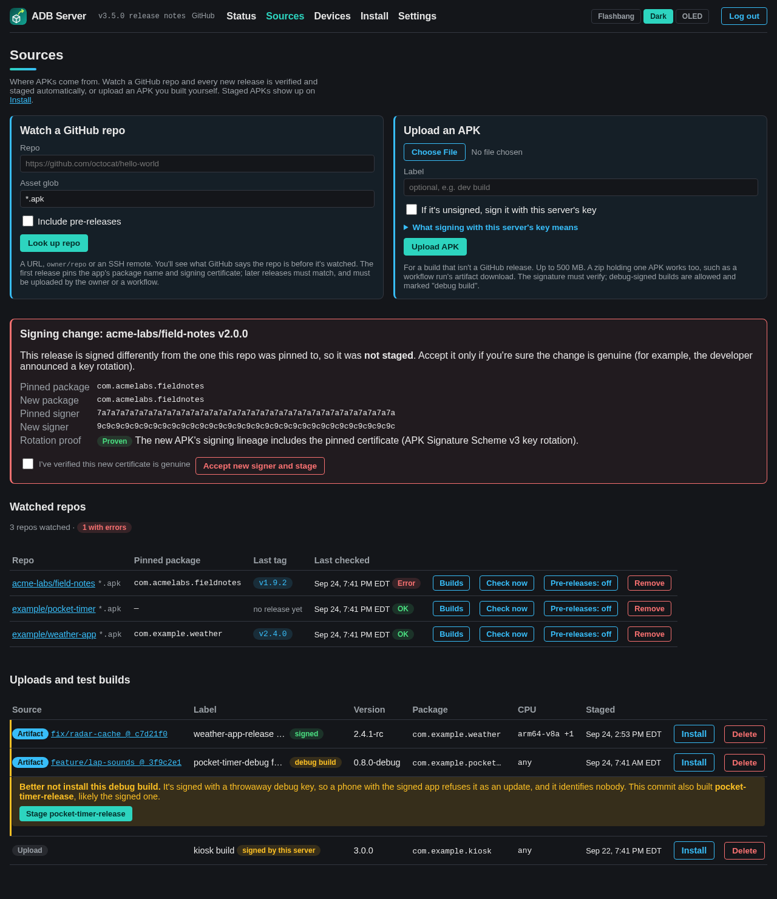
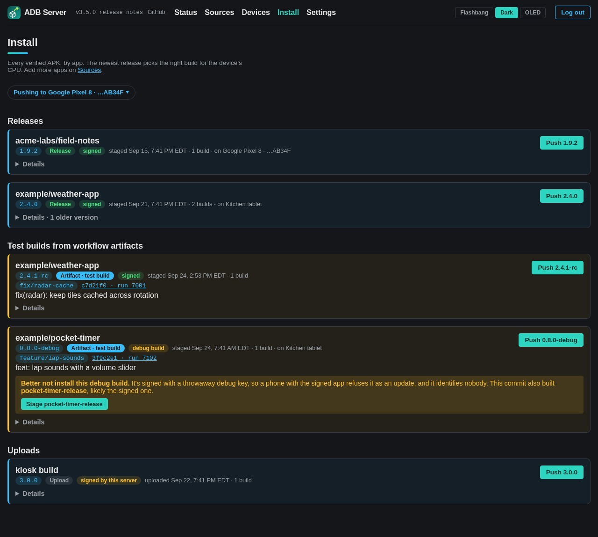
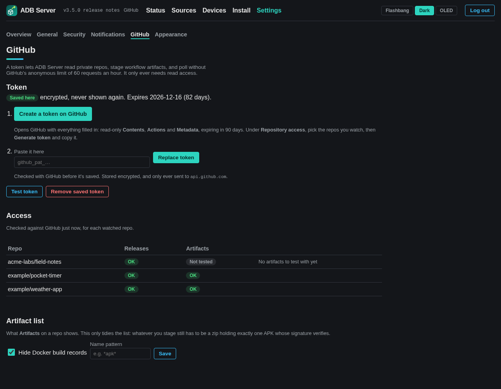
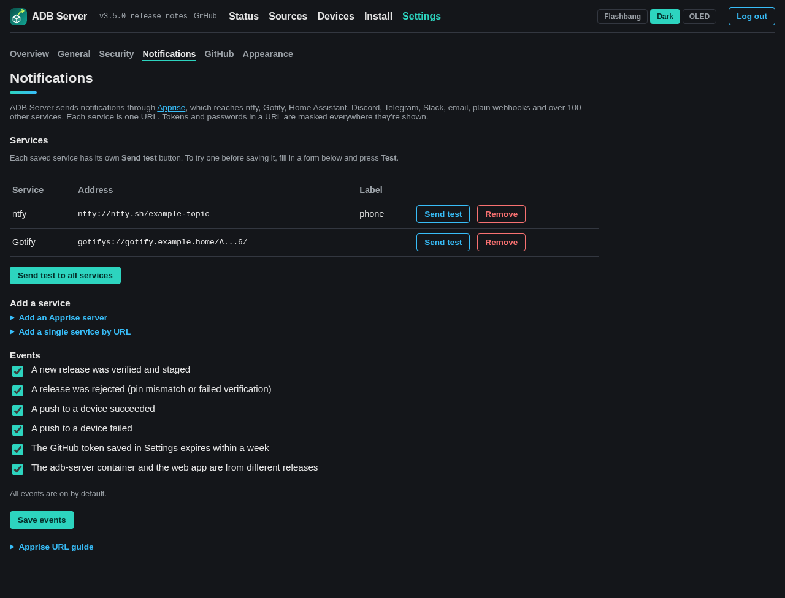

# ADB Server

[GitHub](https://github.com/darthrater78/adb-server) · [Release notes for v3.5.0](https://github.com/darthrater78/adb-server/releases/tag/v3.5.0)

*APK Pusher*: a self-hosted app that watches GitHub repos for new APK
releases, verifies them, stages them, and pushes them over wireless ADB to
Android devices you've explicitly trusted.


- **Watches GitHub releases** and downloads matching APKs as soon as they're
  published, including per-ABI builds and, if you ask, pre-releases.
- **Verifies every APK** before it can reach a device: the signature must
  verify, and the package name and signing certificate must match the ones
  pinned for that repo on its first release.
- **Pushes to your phones** with one click, or automatically for apps a device
  follows. It re-confirms the device's identity and trust right before every
  install.
- **Pairs phones by pairing code**, and finds them again when
  wireless debugging moves to a new port.
- **Has a security posture made for a home server:** two-factor sign-in, an
  audit log, no client-side JavaScript, hardened containers, and an ADB port
  that never touches your LAN. See [Security](#security).

*All screenshots in this README come from a throwaway test stack filled with
invented data. The repos, devices, serials, addresses and hashes are all made
up.*

## Contents

- [How it fits together](#how-it-fits-together)
- [Quickstart](#quickstart)
- [Features](#features)
- [Release verification](#release-verification)
- [Security](#security)
- [Configuration](#configuration)
- [Development](#development)
- [Non-goals](#non-goals)

## How it fits together

Two containers, defined in `compose.yaml`, neither on the host network:

| Container | What it does | Network |
|---|---|---|
| **app** | FastAPI + SQLite. Polls GitHub, verifies and stages releases, serves the web UI, and drives `adb` to pair, connect and install. | Private compose network. Publishes port 8080. |
| **adb-server** | Runs the `adb` server and holds its private key, the identity every paired phone trusts. | Private compose network only. **No published port.** |

```
 browser ──HTTP(S)──▶ app ──adb protocol──▶ adb-server ──TLS (wireless ADB)──▶ phones
 GitHub API ◀──HTTPS── app (release polling, asset downloads)
```

## Quickstart

The stack uses two places, which are often in different directories:

| Where | What's in it | Example |
|---|---|---|
| **Stack directory** | `compose.yaml` and `.env`, always side by side | Wherever you keep compose files, e.g. `~/stacks/adb-server` |
| **Data directory** | `adbkeys/` (the adb key every paired phone trusts), `appdata/` (the database and staged APKs) and `adbinfo/` (the adb-server image's version, for the app to check) | `/opt/docker/adb-server`, as in the `volumes:` lines below |

`compose.yaml` reads `.env` from its own directory, so `.env` goes wherever
`compose.yaml` goes, never into the data directory. To keep the data somewhere
other than `/opt/docker/adb-server`, change the left side of every `volumes:`
line.

**1. Create the data directories.** They belong to uid 10001, the user the
containers run as:

```bash
sudo mkdir -p /opt/docker/adb-server/{adbkeys,appdata,adbinfo} && sudo chown 10001:10001 /opt/docker/adb-server/{adbkeys,appdata,adbinfo} && sudo chmod 700 /opt/docker/adb-server/{adbkeys,appdata,adbinfo}
```

**2. Create `.env` in the stack directory.** `cd` into it first (create it if
it doesn't exist yet). Then run this line on its own. It asks for the username
and password you'll sign in with, so the password stays out of your shell
history:

```bash
read -rp 'Username: ' ADB_USER && read -rsp 'Password: ' ADB_PASS && echo
```

Then paste this block. It writes `.env` into the current directory, generates
the session key, and allows the server's IP and hostname as addresses to
browse to:

```bash
cat > .env <<EOF
SECRET_KEY=$(openssl rand -hex 32)
APP_USERNAME='$ADB_USER'
APP_PASSWORD='$ADB_PASS'
ALLOWED_HOSTS=localhost,$(hostname -I | awk '{print $1}'),$(hostname)
COOKIE_SECURE=false
EOF
chmod 600 .env && unset ADB_PASS && grep ALLOWED_HOSTS .env
```

Check the `ALLOWED_HOSTS` line it printed. What each setting does:

| Setting | What it's for |
|---|---|
| `SECRET_KEY` | Signs the session cookies and encrypts the secrets kept in the database. Changing it signs everyone out, and those secrets must be entered again. Use at least 32 characters (the block above generates 64); anything shorter is warned about on every page. |
| `APP_USERNAME`, `APP_PASSWORD` | Your sign-in. Placeholders like `admin` or `changeme` are refused as passwords, and one shorter than 12 characters is warned about on every page. Don't use `'` in the password. |
| `ALLOWED_HOSTS` | Every name or IP you'll type in the address bar, without `http://` or a port. If yours isn't listed, every page shows only **Invalid host header**. Add any other name, such as `adb.home.lan`, with a comma. |
| `COOKIE_SECURE` | `false` for plain `http://<IP>:8080`, or the browser drops the session cookie and sign-in silently fails. Behind a TLS proxy, set it to `true` and add `ALLOWED_ORIGIN=https://<your-name>`. |

Everything else has a working default ([Configuration](#configuration)). After
editing `.env`, run `docker compose up -d` again. `docker compose restart`
doesn't re-read it.

**3. Create `compose.yaml` in the stack directory**, next to `.env`:

```yaml
services:
  adb-server:
    image: ghcr.io/darthrater78/adb-server/adb-server:3.5.0
    container_name: adb-server
    hostname: adbserver
    restart: unless-stopped
    networks:
      - internal
    volumes:
      - /opt/docker/adb-server/adbkeys:/home/adb/.android
      - /opt/docker/adb-server/adbinfo:/adbinfo
    read_only: true
    tmpfs:
      - /tmp
    cap_drop:
      - ALL
    security_opt:
      - no-new-privileges:true
    healthcheck:
      test: ["CMD", "adb", "-P", "5037", "devices"]
      interval: 60s
      timeout: 10s
      retries: 3

  app:
    image: ghcr.io/darthrater78/adb-server/app:3.5.0
    container_name: adb-server-app
    restart: unless-stopped
    depends_on:
      - adb-server
    env_file: .env
    ports:
      - "8080:8080"
    networks:
      - internal
    volumes:
      - /opt/docker/adb-server/appdata:/data
      - /opt/docker/adb-server/adbinfo:/adbinfo:ro
    read_only: true
    tmpfs:
      - /tmp:size=64m
      - /home/appuser/.android:size=1m,uid=10001,gid=10001,mode=0700
    cap_drop:
      - ALL
    security_opt:
      - no-new-privileges:true
    healthcheck:
      test: ["CMD", "python", "-c", "import urllib.request; urllib.request.urlopen('http://127.0.0.1:8080/healthz', timeout=5)"]
      interval: 60s
      timeout: 10s
      retries: 3
      start_period: 20s

networks:
  internal:

# image: both pinned to this release (3.5.0), updated with every release; the app warns if they differ
# hostname: phones list this server as "<user>@adbserver"; keep it fixed or they show a new name
# adb-server has no ports: only app reaches it. Never use network_mode: host (its adb port has no auth)
# env_file: .env sits next to this file (not in the data directory): login, session key, ALLOWED_HOSTS
# ALLOWED_HOSTS must list the name or IP in your address bar, or every page is "Invalid host header"
# ports: 8080 is the web UI over plain HTTP. Behind a TLS proxy, bind "127.0.0.1:8080:8080"
# /opt/docker/adb-server/adbkeys: the adb key every paired phone trusts. Back it up, keep it private
# /opt/docker/adb-server/appdata: the database and staged APKs. Back this directory up
# /opt/docker/adb-server/adbinfo: adb-server writes its version there, app reads it (read-only). No secrets
# adbkeys, appdata and adbinfo must be owned by uid 10001 (the containers' user), or they can't write to them
# read_only + tmpfs: /tmp is scratch for apksigner; ~/.android is needed by the adb client, holds no keys
```

**4. Start it:** `docker compose up -d` from the stack directory. To build the
images yourself instead, see [Development](#development).

> **Upgrading from 3.3.0 or earlier?** 3.4.0 adds a third data directory,
> `adbinfo/`, where the adb-server container publishes its version for the app
> to check ([Both containers on one release](#both-containers-on-one-release)).
> Create it:
>
> ```bash
> sudo mkdir -p /opt/docker/adb-server/adbinfo && sudo chown 10001:10001 /opt/docker/adb-server/adbinfo && sudo chmod 700 /opt/docker/adb-server/adbinfo
> ```
>
> Then, in your `compose.yaml`, set both images to `3.5.0` and add one
> `volumes:` line to each service, as in the file above:
>
> - `adb-server`: `- /opt/docker/adb-server/adbinfo:/adbinfo`
> - `app`: `- /opt/docker/adb-server/adbinfo:/adbinfo:ro`
>
> and run `docker compose pull && docker compose up -d`. Until the directory
> is mounted into both, every page warns that the app can't tell which
> version adb-server runs.

Then open `http://<server>:8080` and sign in. The home page walks you through
the rest:

1. **Sources**: watch the GitHub repos you want to follow, or upload an APK.
2. **Devices**: pair your phone with its pairing code, and trust it.
3. **Install**: push an app to it.

Then turn on two-factor sign-in under **Settings → Security**.

> **Plain HTTP or TLS?** Out of the box the UI is served over plain HTTP on
> all interfaces. That's a deliberate trade-off for a trusted home network
> (see [Known limitations](#known-limitations-and-accepted-risks)). Browsers
> won't send `Secure` cookies over plain HTTP to anything but `localhost`, so
> for `http://<LAN-IP>:8080` set `COOKIE_SECURE=false`. The better setup is
> TLS: put a reverse proxy (Caddy, Tailscale Serve, …) in front, keep
> `COOKIE_SECURE=true`, set `ALLOWED_ORIGIN=https://<your-name>`, set
> `FORWARDED_ALLOW_IPS` to the proxy's IP address, and bind the app to
> `127.0.0.1:8080` in `compose.yaml`. Without `FORWARDED_ALLOW_IPS`, every
> sign-in seems to come from the proxy, so a few wrong passwords from anyone
> lock everyone out for 5 minutes.


## Features

The app follows the order you use it in: **Status · Sources · Devices ·
Install · Settings**.

### Status: the home page

One card per device, with everything pushed to it: each watched app's
installed version against the latest staged one, with an **Update** or
**Install** button, and anything you uploaded and pushed by hand. The button
picks the right APK for that device's CPU and asks you to confirm first. Each
card also lists the device's last few installs. **Refresh installed versions**
asks each device what it has now; versions also refresh after every push.
Untrusted devices are shown, but offer nothing to push.

Under each installed version is **where it came from**: a **Release** (and
its tag), a **Test build** (branch @ commit, linked to its workflow run), an
**Upload**, or **Not from this server** when it was installed some other way
or replaced since this server last pushed it. A debug-signed build is marked
**Debug**. The server records what it pushed, and the device's own install
time tells a later reinstall of the same version apart. Versions pushed
before 3.5.0 are matched by version alone and marked *(likely)*.

**Auto-update** is set per app and per device. When it's on, each newly staged
release is pushed to that device automatically. This only works for trusted
devices, and a device that already has that version or a newer one is skipped.

Until you've added a source, trusted a device and installed something, the
page shows a setup checklist instead.




### Sources: repos and uploads

Everything APKs come from, on one page.

**Watch a GitHub repo** as a URL, `owner/repo` or an SSH remote, plus an asset
glob (default `*.apk`). **Look up repo** first shows what GitHub says it is:
owner (user or organization), description, created date, stars and its
GitHub ID, with a warning if it's a fork, archived, under 30 days old, or has
no release yet. Nothing is watched until you confirm it's the repo you meant
(see [Source verification](#source-verification)).



Repos are polled every `POLL_INTERVAL_MINUTES`
(default 10). **Check now** checks immediately, in the background: the page
reloads itself until the check is done, then says what it found.
Pre-releases are ignored unless you turn **Pre-releases** on for that repo.
Polls use conditional requests (ETags); with `GITHUB_TOKEN` set, an unchanged
repo doesn't use up GitHub's rate limit (GitHub only waives it for
authenticated requests). When a release is signed by a different certificate than
the pinned one, a **Signing change** panel shows both certificates and whether
the new APK proves the rotation (see [Release verification](#release-verification)).

**Builds** on a watched repo has two lists:

- **Releases**: its published releases. **Stage** an older one and it goes
  through every release check (uploader, signature, the pin, no debug
  builds). It doesn't become "latest": auto-update and **Push latest** go by
  release date, so they keep using the newest release.
- **Test builds from workflow artifacts**: builds from its recent workflow
  runs, grouped by commit, each commit with its message. **Stage** treats
  one exactly like an uploaded zip (below) and records the repo, run, branch
  and commit it came from. Its **build notes** on Install stand in for
  release notes: the run, the pull request's description if it was built for
  one, and the full commit message. Each build is badged by how it's signed
  (**signed · same key as releases**, **signed · different key**, **debug
  build** or **unsigned**) with a note on which to pick: only a build signed
  with the releases' key updates the app a phone got from them. That's only
  known once a build is downloaded, so **Check signing** downloads it, checks
  it and deletes it; staging one records it too. Only builds from the repo's own branches
  are listed: never one from a pull request opened from a fork, and never a
  release's own build (its tag's run, or its tagged commit), which is under
  Releases.



**Refresh from GitHub** fetches both lists fresh. Test builds need a token with
**Actions: read** on that repo, saved under **Settings → GitHub** (or
`GITHUB_TOKEN` in `.env`): GitHub serves artifact downloads only to an
authenticated caller, even for a public repo. Settings → GitHub can also hide
Docker build records (`*.dockerbuild`, on by default) and limit the list to a
name pattern.

**Only repos with APKs can be added.** The review refuses a repo unless one
of its releases has an asset matching the glob, or (with a token) one of its
recent workflow artifacts holds an `.apk`. That artifact is checked by
reading only its zip's file list, not by downloading it. A repo with builds
but no release yet shows **no release yet**, not an error.

**Unsigned builds** can't be installed on Android at all. They're refused
unless you opt in for that source: **Sign unsigned builds from this repo** on
its Builds page (releases and test builds), or the **sign it with this
server's key** box on an upload. The server then signs the build with a key
it keeps for that source alone: one per watched repo (by its GitHub ID, so
removing and re-adding the repo keeps it) and one for uploads, each created on
first use and kept next to the database, with its password encrypted. It's
marked **signed by this server**, and the phone will only accept updates to
that app signed by the same key, until the app is uninstalled. Because no two
sources share a key, one source's build can never pass as an update to
another source's app. Settings → Security lists each key's fingerprint. Back up the data directory and `.env` together. A build whose
signature is present but doesn't verify is always refused, and a release
signed with the Android debug certificate is refused either way.

**Upload an APK** (up to 500 MB) for builds that aren't published as GitHub
releases, either the APK itself or a zip holding exactly one APK, such as a
workflow run's artifact download. Its signature must still verify, and its signer is recorded. It
belongs to no watched repo, so it neither sets nor is checked against a repo's
pin: you, the uploader, are its provenance. Uploads may be debug-signed, and
such builds are marked **debug build** for as long as they stay staged. If the
upload's package matches a watched repo but its signer doesn't, you're warned
that Android will refuse one over the other. Re-uploading a file that's
already staged is refused.

Every staged build is badged by how it's signed: **signed** (the developer's
own key), **debug build**, or **signed by this server**. A debug-signed test
build whose commit also produced other builds is flagged **Better not install
this debug build**, with a button to stage the other one instead: a phone with
the signed app refuses a debug build as an update.



### Devices

Follow the steps at the top of the page. On the phone, open Settings →
Developer options → Wireless debugging → *Pair device with pairing code*, then
enter the pairing address and 6-digit code the phone shows, plus its connect
address. A new device starts **untrusted**: press **Trust** before it can
receive pushes.

The connect port changes whenever wireless debugging restarts. Before every
push, the app reconnects to the device. If the stored port is dead, it scans
the device's last known IP (`ADB_SCAN_PORTS`, default `30000-49999`) and
accepts a port only if the device there reports the **same hardware serial**.
**Find** does this on demand. If the phone's IP itself changed, use
**Reconnect** with its new address. Nicknames, trust and forgetting a device
are all on this page. Phones list this server as `@adbserver`.


### Install

Every verified APK, one card per app, showing just the essentials: name,
version, where it's from, signing, when it was staged, and which devices
already have it. **Pushing to ▾** at the top picks the device every **Push**
on the page goes to (the most recently paired one to start). For a watched
repo, the newest release is pushed, in the build that fits the device's CPU.
When a release has several APKs that match the glob (per-ABI builds such as
`arm64-v8a`, `armeabi-v7a` or universal), all of them are staged, up to 6.
**Details** on a card opens the rest: the package name, release notes, every
staged file (to push a specific one or delete it) and older versions.

Cards are grouped as **Releases**, **Test builds from workflow artifacts** and
**Uploads**. A test build is marked **Artifact · test build**, with its branch
and commit linked to the workflow run, so it can't be mistaken for a release.
Devices are named by their nickname, else its model and the
end of its serial (e.g. `Google Pixel 8 · …005KT`), read when the app first
talks to it.

Only the newest `KEEP_RELEASES_PER_REPO` releases per repo (default 3) are
kept on disk. Older ones are deleted automatically. Install history is kept
either way.



Every push runs in the background. Submitting one takes you to a live status
page that refreshes until the install finishes, including `adb`'s own output.


### Settings

**Settings** opens on an overview: one card per area (General, Security,
Notifications, GitHub, Appearance) showing its current state, such as whether
two-factor is on, how many notification services there are, and whether the
GitHub token is set and when it expires. Each card opens that area's page.


**Settings → General** sets the time zone every date and time is shown in, and
a 12-hour (1:05 PM, the default) or 24-hour clock, for everyone who signs in.
Times are stored in UTC, and hovering one shows it exactly. Until a zone is
saved there, `TZ` from the environment is used, else UTC.

### GitHub token

**Settings → GitHub** gets you a token in two steps:

1. **Create a token on GitHub** opens GitHub's fine-grained token page with
   everything filled in: read-only **Contents**, **Actions** and **Metadata**,
   a 90-day expiry, named for this server. The one thing GitHub can't
   pre-fill is which repos it covers: pick the ones you watch, then
   **Generate token**.
2. Paste it back. It's checked with GitHub before it's saved, then stored
   encrypted and never shown again.

The page then shows when the token expires (you're notified a week before,
if the **token expiring** event is on), and an **Access** table that checks
each watched repo for real: whether the token can read it, and whether it can
download its artifacts. A public repo is readable with any token, so only
asking GitHub for an artifact's download link, which it hands out only when
the token may download it, proves the repo was included. A token in
`GITHUB_TOKEN` in `.env` still works; one saved here takes precedence.



### Activity: install history and audit log

Both are linked from the **Settings** overview. **Install history** keeps every push
and its log.

**Audit log**: logins (including failed ones and how the second step was
passed), two-factor changes, trust changes, signer re-pins, repo and device
changes, uploads, auto-update toggles, pushes and notification changes, each
with the client IP. The newest 5000 entries are kept. Secrets are never
written to it.

<p>
  
  
</p>

### Notifications

Notifications go through [Apprise](https://github.com/caronc/apprise/wiki),
which covers ntfy, Gotify, Home Assistant, Discord, Telegram, email, plain JSON
webhooks and about 100 more services, one URL each. You can be told when a
release is staged or rejected, when a push succeeds or fails, when the
GitHub token saved in Settings is about to expire, and when the two containers
are from different releases (see [Both containers on one release](#both-containers-on-one-release)).

On **Settings → Notifications** you can:

- **Add an Apprise server** ([Apprise API](https://github.com/caronc/apprise-api)):
  paste its notify URL (e.g. `http://apprise.local:8000/notify/my-key`), or
  its address and config key, plus optional tags. The services themselves
  stay managed on the Apprise server.
- **Add a service directly**: any single Apprise URL.
- Pick which events notify, and **Send test** to one service or to all.
  Each test reports whether the message was delivered. The add forms have a
  **Test** button too, for trying a URL before you save it. A URL guide for
  common services is on the page.

Tokens and passwords in a URL are shown masked and never logged. `APPRISE_URLS`
and `NOTIFY_EVENTS` in `.env` also work: those services appear marked `.env`
and can only be changed there. Events saved on the page override
`NOTIFY_EVENTS`.



### Both containers on one release

The web app and the adb server are two images from the same release, but
they're pulled and recreated separately, so one can be left behind. The app
checks both ways, when it starts and every 5 minutes:

- **Image version.** On start, the adb-server container writes its version
  into `adbinfo/`, which the app mounts read-only, and the app compares it
  with its own.
- **adb protocol.** The app asks the adb server which protocol it speaks and
  compares that with its own adb client, since a mismatch there breaks
  pairing and installs outright.

If either differs, or `adbinfo/` isn't mounted into both containers, every
page shows a warning with the fix (`docker compose pull && docker compose up
-d`), and the **version mismatch** notification is sent once. Settings →
General shows both versions.

### Appearance

**Settings → Appearance** sets two colours for the whole app: a **primary**
(solid buttons, the current page) and a **secondary** (links, tags, outlined
buttons, focus rings). Pick a preset pair or any two custom colours. Name a
custom pair and **Save as preset** to keep it. Colours are darkened or
lightened per theme so text stays readable (WCAG AA contrast). The header's
**Flashbang / Dark / OLED** buttons pick a theme for this browser. Without
one, the app follows your OS's light/dark setting. The layout adapts to phones
and tablets (labelled cards up to 960px wide).

### Two-factor sign-in

**Settings → Security** adds a second step after the password: a 6-digit code
from any authenticator app (TOTP: Google Authenticator, Aegis, 1Password,
Bitwarden, …). Setup shows a QR code, then 10 single-use **recovery codes**.
Save them, because they're shown only once. When you sign in you can tick
**Trust this browser for 30 days**. Trusted browsers are listed in Settings,
where you can revoke one or all. Turning two-factor off, or making new
recovery codes, needs a current code.

<p>
  
  
</p>

If you're locked out, or you've lost both your phone and your recovery codes,
run these from the server:

```sh
docker compose exec app python mfa_admin.py status
docker compose exec app python mfa_admin.py unlock   # clear the lockout after too many wrong codes
docker compose exec app python mfa_admin.py reset    # turn two-factor off and sign everyone out
```

### Header links

Next to the logo, the running version links to **its release notes** on
GitHub (`…/releases/tag/v<version>`), and **GitHub** links to this
repository.

### Health checks

Every container has a Docker health check. `app` checks `/healthz`, which is
unauthenticated and returns only ok or error. `adb-server` checks that the adb
server answers. `127.0.0.1` is always
an accepted host, so the check works whatever `ALLOWED_HOSTS` says. If the UI
answers a bare "Invalid host header", the name you browsed to isn't in
`ALLOWED_HOSTS`. The app logs the accepted list at startup.

## Source verification

Checks that a watched repo is the real source before anything from it is
trusted. They run before [Release verification](#release-verification).

- **Reviewed before it's watched.** Adding a repo is two steps: look it up,
  then confirm. The review page shows GitHub's own account of the repo and
  warns about the signs of a look-alike: a fork, an archived repo, one under
  30 days old, one with no release. Confirming re-checks that the name still
  points at the repo you reviewed.
- **Pinned by GitHub ID.** GitHub never reuses a repo or account ID, but a
  name can be re-registered by someone else after a rename or deletion. The
  repo's ID and its owner's ID are pinned when you confirm it (repos added
  before 3.3.0 are pinned on their first poll). Before anything new is
  downloaded, the name must still resolve to the pinned repo and owner. A
  different repo under the name, a transfer to another owner, or a rename
  stops that repo, with a notification, until you remove and re-add it.
- **Assets from the owner or a workflow.** Each release asset records who
  uploaded it. For a user's repo it must be the owner or
  `github-actions[bot]`, which only the repo's own workflows can act as. For
  an organization's repo it must be `github-actions[bot]`: members'
  access can't be checked from here, so assets must come from a workflow.
  Anything else rejects the release before it is downloaded.
- **Artifacts from the repo's own runs.** A pull request from a fork runs
  its workflows in the base repo and its artifacts are listed there, but
  anyone on GitHub can open one. Only artifacts whose run was built from the
  repo itself are listed or staged. Artifacts are test builds: like uploads,
  they may be debug-signed and don't read or change the release pin.

## Release verification

- **Trust on first use, then pinned.** The first release staged for a repo
  pins its **package name** and **signing certificate SHA-256**. Every later
  release must match both. A mismatch is rejected and shown on the Sources page.
  It is never skipped silently and never trusted automatically. This stops a
  compromised upstream account, or a malicious asset uploaded to someone
  else's release, from reaching your devices unnoticed.
- **Every signer counts.** All of an APK's signers are checked and pinned,
  not just the first.
- **Unsigned APKs are rejected** unless the repo opted in to having this
  server sign them (see [Sources](#sources-repos-and-uploads)), and a
  **debug-signed release** is always rejected. The default Android debug certificate is generated per machine
  and identifies nobody, and nobody is watching when the poller runs. A
  debug-signed release never becomes a pin.
- **One release, one identity.** Every APK in a release must share the same
  package and signer, or the whole release is rejected.
- **Signing-key rotation** is a reviewed decision. The Sources page shows both
  certificates and whether the new APK carries an APK Signature Scheme v3
  proof-of-rotation linking it to the pinned key. Accepting the new
  certificate re-pins the repo and stages that release. The acceptance is
  written to the audit log.
- **Integrity checks.** Downloads are capped at 500 MB, must be real APK
  archives (a zip with an `AndroidManifest.xml`), and must match GitHub's
  reported SHA-256 digest when GitHub provides one.
- **Rejected once.** A rejected release is checked once, then skipped (with
  the error still visible) until a newer release appears.

## Security

ADB Server can install software on your phones, so it's built with
**defence in depth**. No single control is trusted to stop everything. This
section covers what is protected, how, and what isn't.

### Threat model

It's designed for **one operator on a home or small-office network**.

| It defends against | How |
|---|---|
| A compromised or malicious upstream: a hijacked GitHub account, a tampered release asset | Package and signer pinning, signature verification, reviewed key rotation ([Release verification](#release-verification)) |
| A look-alike or re-registered repo name, a release asset uploaded by someone else | Review before watching, GitHub-ID and owner pinning, uploader checks ([Source verification](#source-verification)) |
| Someone on the LAN trying to reach your phones' ADB | The adb server's port is never published. Only the app can talk to it. |
| Password guessing, stolen passwords | Per-client rate limiting (IPv6 by /64), TOTP two-factor sign-in, a global lockout on wrong codes |
| Cross-site attacks from other tabs or sites | CSRF tokens, Origin checks, `SameSite=Strict` cookies, a strict CSP with no JavaScript at all |
| DNS rebinding | A Host-header allowlist (`ALLOWED_HOSTS`) |
| Stolen session cookies | 12-hour expiry, and logout revokes every session |
| Pushing to the wrong phone | Hardware-serial identity checks and a trust re-check immediately before every install |
| Unauthenticated resource exhaustion | Request size caps enforced before a body is read |

**Out of scope.** It does not defend against someone who holds your password
*and* your second factor, anyone with root or Docker access on the host, or
passive sniffing on your LAN if you serve it over plain HTTP (use TLS; see
below).

### Authentication

- **Fails closed.** The app refuses to start without `SECRET_KEY`,
  `APP_USERNAME` and `APP_PASSWORD`, or with a placeholder password such as
  `changeme`.
- **Constant-time credential checks.** The username and password are both
  compared every time, so response timing doesn't reveal which one was wrong.
- **Rate limiting.** 5 failed attempts per client in 5 minutes, for both the
  password and the code step. A client is its IPv4 address, or its IPv6 /64,
  so rotating through one network's IPv6 addresses doesn't buy more guesses.
  Behind a reverse proxy, set `FORWARDED_ALLOW_IPS` to the proxy's address so
  each browser is counted by its own address rather than the proxy's. The
  tracking table is swept and capped, so a flood of addresses can't grow it
  without bound.
- **Short secrets are flagged.** A `SECRET_KEY` under 32 characters or an
  `APP_PASSWORD` under 12 is logged at startup and shown as a warning on every
  page. The app still starts, so an upgrade never locks you out.
- **Two-factor sign-in (TOTP, RFC 6238).** The implementation uses only the
  standard library (HMAC-SHA1, 30-second steps, ±1 step for clock drift), so
  there's no third-party dependency to trust. The password alone only yields
  a 5-minute pending cookie that unlocks the code form, nothing else.
  - A code works **once**, even inside its 30-second window. The used step is
    claimed atomically, so parallel requests can't spend the same code twice.
  - **5 wrong codes lock the second step for 15 minutes**, globally rather than
    per IP, because whoever gets that far already has the password. Attempts
    are counted *before* a code is checked, so a burst of parallel guesses
    can't get more than 5 tries.
  - **Recovery codes**: 10 single-use codes with about 49 bits of entropy each,
    stored only as SHA-256 hashes.
  - **Trusted browsers**: a signed cookie holding a random token. Only the
    token's hash is stored, so a trusted browser can be revoked from Settings,
    and a copy of the database can't be replayed as a trust cookie.
  - Turning two-factor **on** signs out every other session. Turning it
    **off**, or replacing recovery codes, needs a current code.
  - **Server-side recovery** (`mfa_admin.py`) needs a shell on the host. That's
    the proof of ownership, because a shell already means full control.

### Sessions and requests

- **Session cookies** are signed (itsdangerous, HMAC with `SECRET_KEY`),
  `HttpOnly`, `SameSite=Strict`, `Secure` (unless `COOKIE_SECURE=false`), and
  expire after 12 hours.
- **Revocation.** Every cookie carries a session epoch. Logging out,
  enabling two-factor, or `mfa_admin.py reset` bumps the epoch, which signs
  out **every** session, so a copied cookie stops working too.
- **CSRF.** Every state-changing request needs a per-session token in the form
  body, compared in constant time. The `Origin` header must also match, when
  the browser sends one. The login form has no session yet, so the Origin
  check is its cross-site defence.
- **Host allowlist.** Requests for any host not in `ALLOWED_HOSTS` are refused,
  which blocks DNS-rebinding attacks.
- **Body limits before parsing.** FastAPI reads a request body before any
  auth check runs, so limits are enforced in middleware, before anything is
  read. Every POST must declare its length. Forms are capped at 64 KB. Only
  the upload route accepts files, and only from a signed-in session, up to
  500 MB. Anyone else who can reach the port can't fill the disk.
- **Browser hardening.** The app ships **no JavaScript**. Dialogs, live pages
  and navigation use plain HTML and CSS. The Content-Security-Policy is
  `default-src 'self'; style-src 'self'; script-src 'none'; frame-ancestors
  'none'; base-uri 'none'; form-action 'self'`. Pages are sent with
  `X-Frame-Options: DENY`, `X-Content-Type-Options: nosniff` and
  `Referrer-Policy: no-referrer`. Templates autoescape everything they
  render.
- **No open redirects.** Redirect targets come from a fixed allowlist of the
  app's own pages.
- **Secrets stay out of URLs.** Pages that show a secret (two-factor setup,
  recovery codes) are sent with `Cache-Control: no-store`. A notification URL
  you're testing is re-rendered in the form, never placed in a redirect.

### Devices and pushes

- **Untrusted by default.** A newly paired device can't receive
  anything until you trust it. Trust is enforced on the server, at queue time
  *and again at install time*, not by hiding a button.
- **Identity is the hardware serial** (`ro.serialno`), not the address. Before
  every push the app reconnects and confirms the serial. It never pushes to
  whatever happens to answer on an old address.
- **Narrow network reach.** Device addresses must be literal IPs on private or
  loopback ranges (never hostnames, never public IPs), and they're checked so
  they can't be read as `adb` options. A port scan only ever touches the last
  known private IP of a device you already paired.
- **Safe installs.** Always `adb install -r`, never `-g` (grant all
  permissions), `-d` (allow downgrade) or `-t` (test APKs). Android's own
  signature check still refuses an update signed by a different key.

### Manual uploads

- The signature must verify, exactly as for a polled release. Unsigned or
  malformed files are refused.
- The file is stored as `uploads/<sha256>.apk`. The name your browser sent is
  display text only, reduced to a safe character set, and is never used as a
  path.
- Debug-signed uploads are allowed but permanently marked **debug build**.
  You're warned when an upload's package matches a watched repo but its
  signer doesn't.
- A zip must hold exactly one `.apk`. It is streamed out under the same
  500 MB cap, counted on the bytes actually unpacked rather than the size the
  zip declares. Nothing is ever written under a name from the zip, zips
  inside it aren't opened, and encrypted entries are refused. The zip is
  deleted as soon as the APK is out, before any check runs. The APK then
  faces every check above, and duplicates are matched on the APK, not the zip.

### GitHub access

- A GitHub token is optional: saved in **Settings → GitHub** (checked
  with GitHub first, stored encrypted, never shown again), or `GITHUB_TOKEN`
  in `.env`. Either way it should be a fine-grained,
  read-only token scoped to the repos you watch: **Contents: read** for
  releases, plus **Actions: read** to stage workflow artifacts.
- The token is sent **only to `api.github.com`**. Asset downloads follow
  GitHub's redirect manually, without the `Authorization` header, only over
  HTTPS, and only to GitHub's own hosts (and, for workflow artifacts, the
  Azure blob storage GitHub serves them from).
- Owner and repo names are validated against a strict pattern. File paths are
  never built from tag or asset names, which are upstream-controlled.

### Containers and network

- **The adb server is never on the LAN.** Its port 5037 is unauthenticated by
  design, so it is published nowhere and reachable only from `app` over the
  private compose network. Never put `adb-server` on `network_mode: host`.
- **No host networking.** Every container is on the private compose network;
  only `app`'s port 8080 is published.
- **Least privilege everywhere.** Both containers run as a non-root user
  (uid 10001) with `cap_drop: [ALL]`, `no-new-privileges`, and a **read-only
  root filesystem**. Writable paths are only the data bind mounts and small
  tmpfs mounts.
- **Verified tooling.** `adb`, `apksigner` and `aapt2` come from Google's
  official releases, with pinned URLs and SHA-256 checksums verified at build
  time. They're never taken from third-party images.
- **Pinned bases.** Every base image is pinned by digest.

### Data at rest

| Data | Where | Protection |
|---|---|---|
| adb private key (every paired phone trusts it) | `/opt/docker/adb-server/adbkeys` | Only `adb-server` mounts it |
| Database: repos, devices, audit log, settings | `/opt/docker/adb-server/appdata` (`app.db`) | Only `app` mounts it |
| The adb-server image's version | `/opt/docker/adb-server/adbinfo` (`version`) | No secret. `adb-server` writes it, `app` mounts it read-only and accepts only a version string from it |
| TOTP secret, notification service URLs, GitHub token saved in Settings | In the database | **Encrypted** (Fernet: AES-128-CBC + HMAC-SHA256) with a key derived from `SECRET_KEY` by HKDF. The key is never stored, so the database or a backup of it reveals none of them without `.env`. |
| Recovery codes, trusted-browser tokens | In the database | SHA-256 hashes only |
| This server's APK signing keys, one per source (only for sources you opted in to signing unsigned builds) | `appdata/signing/github-<repo ID>.p12`, `appdata/signing/uploads.p12` | PKCS#12 keystores, mode 600. Their passwords are encrypted in the database, like the secrets above |
| `SECRET_KEY`, password, `GITHUB_TOKEN` | `.env` | Keep it `chmod 600`. It's gitignored and excluded from image builds. |

Anyone who can read the `adbkeys` directory, or `appdata` *and* `.env`, can act as
this server. Back those up, and protect the backups the same way.

**Changing `SECRET_KEY`** signs everyone out and makes the encrypted values
unreadable. Nothing is silently dropped: the GitHub token and each
notification service show as unreadable in Settings, to be entered again, and
two-factor sign-in stays on but refuses every code until you reset it with
`docker exec -it adb-server-app python mfa_admin.py reset`.

### Supply chain and CI

- Every Python dependency is pinned to an exact, current version and audited
  with `pip-audit` in CI (`--strict`).
- Dependabot watches pip, the digest-pinned Docker base images and GitHub
  Actions weekly.
- Actions are pinned by commit SHA, with least-privilege `permissions:`.
  Workflow changes are linted with a checksum-verified `actionlint`.
- A release publishes images only for a tag on the default branch that
  matches `VERSION`, and only for a commit CI already passed.

### Recommended hardening checklist

- [ ] Serve it over **TLS** (reverse proxy), keep `COOKIE_SECURE=true`, set
      `ALLOWED_ORIGIN` and `FORWARDED_ALLOW_IPS`, and bind the app port to `127.0.0.1`.
- [ ] **Never expose port 8080 to the internet.** Use a VPN such as Tailscale
      for remote access.
- [ ] Set `ALLOWED_HOSTS` to exactly the names you browse to.
- [ ] Use a long, random `APP_PASSWORD` (12+ characters) and `SECRET_KEY` (32+).
- [ ] Turn on **two-factor sign-in**, and store the recovery codes offline.
- [ ] `chmod 600 .env`.
- [ ] Use a fine-grained, read-only `GITHUB_TOKEN`, or none for public repos.
- [ ] Back up the `appdata` and `adbkeys` directories, and protect the backups.
- [ ] Review the **Audit log** (linked from Settings) from time to time, and Sources whenever
      a signing change is flagged.

### Known limitations and accepted risks

- **Plain HTTP by default.** On the LAN, the password and session cookie
  travel in cleartext unless you add TLS. This is a deliberate default for a
  trusted home network, and the first item on the checklist above.
- **Single operator.** There's one account with no roles. Anyone signed in can
  do everything, including pointing notifications at internal hosts, which is
  as powerful as pushing APKs anyway.
- **The two-factor lockout is global.** Someone who already has your password
  can keep the second step locked. Recovery codes and `mfa_admin.py unlock`
  get you back in.
- **Not everything at rest is encrypted.** The secrets in the database are
  (see [Data at rest](#data-at-rest)), but the rest of it (repos, devices, the
  audit log) and the staged APKs are not. They're protected by file
  permissions and by being mounted only into `app`.

### Reporting a vulnerability

Please don't open a public issue. Use GitHub's private vulnerability reporting
(**Security → Report a vulnerability** on the repository), or contact the
maintainer directly.

### Security review

The whole codebase has been reviewed from top to bottom: routes,
authentication and two-factor, sessions and CSRF, uploads, APK verification,
GitHub access, device identity and pushes, containers, CI and dependencies.
`bandit` reports only reviewed false positives (constant SQL fragments, and
`subprocess` with argument lists and validated input). `pip-audit` is clean, every pin is the latest release,
and Dependabot has no open alerts. Everything the review found was fixed
before release, with a regression test that fails without the fix. See
`CHANGELOG.md`.

## Configuration

All settings live in `.env`, in the stack directory next to `compose.yaml`.
Quickstart step 2 creates it with the required ones; [`.env.example`](.env.example) lists them all.

| Variable | Default | What it does |
|---|---|---|
| `SECRET_KEY` | *(required)* | Signs cookies and encrypts the database's secrets. `openssl rand -hex 32`; under 32 characters is warned about. Changing it signs everyone out. |
| `APP_USERNAME`, `APP_PASSWORD` | *(required)* | The single operator account. |
| `ALLOWED_HOSTS` | `localhost,127.0.0.1` | Host names the app answers to (DNS-rebinding protection). |
| `ALLOWED_ORIGIN` | *(blank: same origin)* | Exact `scheme://host[:port]` forms may come from. Set it behind a TLS proxy. |
| `FORWARDED_ALLOW_IPS` | *(blank: none)* | Your reverse proxy's IP address(es). The app then takes each browser's address from `X-Forwarded-For`, for rate limiting and the audit log. Name only the proxy. |
| `COOKIE_SECURE` | `true` | `false` only for plain-HTTP access to anything but localhost. |
| `GITHUB_TOKEN` | *(blank)* | Fine-grained, read-only PAT (Contents: read; Actions: read for artifacts), for private repos, artifacts or higher rate limits. A token saved in Settings → GitHub takes precedence. |
| `POLL_INTERVAL_MINUTES` | `10` | How often repos are polled. |
| `KEEP_RELEASES_PER_REPO` | `3` | Staged releases kept on disk per repo. |
| `APPRISE_URLS` | *(blank)* | Notification services (space- or comma-separated). |
| `NOTIFY_EVENTS` | *(all)* | `staged,rejected,install_success,install_failed,token_expiring,version_mismatch` |
| `ADB_SCAN_PORTS` | `30000-49999` | Port range scanned to find a device whose port changed. |
| `DB_PATH`, `STAGING_ROOT` | `/data/app.db`, `/data/staging` | Storage locations inside the app container. |
| `ADB_HOST`, `ADB_PORT` | `adb-server`, `5037` | Where the adb server is. |

## Development

```bash
python3 -m venv .venv && . .venv/bin/activate
pip install -r requirements-dev.txt
bash scripts/test.sh
```

Dependencies are pinned in lockfiles with a hash for every package, direct
and transitive, and the image installs with `--require-hashes`. Edit the
direct pins in `app/requirements.in` (or `requirements-dev.in` for test tools),
then regenerate both lockfiles with `pip-tools`, the app's first:

```bash
pip install pip-tools
(cd app && pip-compile --generate-hashes --allow-unsafe --strip-extras requirements.in)
pip-compile --generate-hashes --allow-unsafe --strip-extras requirements-dev.in
```

The screenshots in this README come from invented data, with GitHub mocked:
`bash scripts/screenshots/run.sh <host-ip>` builds the app from the checkout,
seeds it and retakes every one in `docs/screenshots/`.

The tests stub out GitHub, `adb`, `apksigner` and `aapt2`, so they need no
Android tooling and no device.

To run the stack from your own build instead of the published images,
`compose.build.yaml` layers the two `build:` sections over `compose.yaml`:

```bash
docker compose -f compose.yaml -f compose.build.yaml up -d --build
```

CI (`.github/workflows/ci.yml`) runs on every push and PR. It runs the same
test script, checks that `VERSION` matches `CHANGELOG.md`, validates the
compose file, checks that the two lockfiles agree, audits the dependencies,
runs `bandit` (Medium and up fails the build) and builds both images. Pushing a
`v*` tag on the default branch runs `release.yml`, which publishes the images
to `ghcr.io/darthrater78/adb-server/{app,adb-server}` and creates the
GitHub release, but only for a commit CI already passed.

## Non-goals

- Multi-user accounts or roles.
- Push-to-all: one device per push (auto-update covers the rest).
